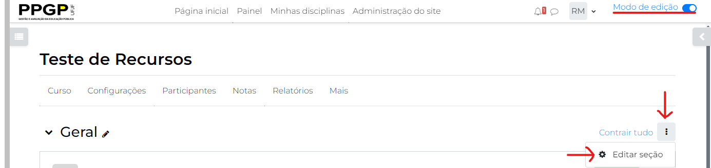
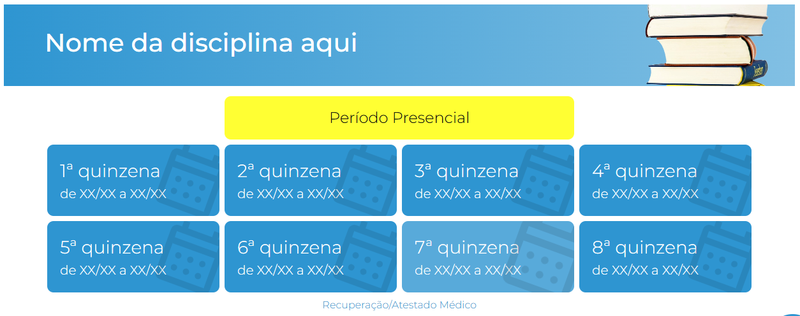

# Cabeçalhos de Disciplinas

**Com o modo de edição ativo**, vá até a primeira seção da sua disciplina (**Geral**, se estiver usando o *Bolinhas*) e clique nos *três pontinhos* e depois em `Editar seção`.



Na próxima tela, na seção Sumário, clique na seta para baixo, como indicado na figura a seguir.


Em seguida, clique no símbolo `</>` para ativar o modo **editor HTML**. Você vai notar que o aparente texto em branco vai se tornar algo parecido com o demonstrado na figura a seguir.


Apague todo o texto contido nesta caixa e substitua pelo trecho de código a seguir:

```html
<div class="ppgp-disciplina-title">
    <h1>Nome da sua disciplina aqui</h1>
</div>
```

Você pode substituir todo o conteúdo entre as duas *tags* `h1` e escrever ali o nome da disciplina que está configurando. Ou, caso não sinta segurança em escrever nessa tela, você pode clicar novamente em `</>`, no painel superior, e retornar para o modo clássico de edição.

Você vai perceber que o layout da primeira tela terá se ajustado à identidade visual do PPGP.



Você pode editar à vontade o nome da sua disciplina nessa tela, sem precisar olhar mais para a edição em HTML.

Feito isso, basta clicar em `Salvar mudanças` e o cabeçalho da sua disciplina estará publicado.