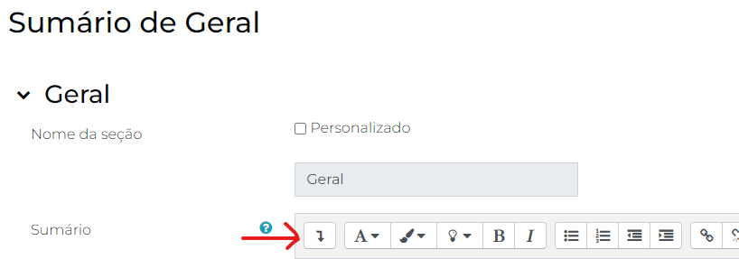

# Cabeçalhos das Quinzenas

**Com o modo de edição ativo**, vá até o local onde a nova quinzena será adicionada e clique em `Adicionar tópico`.


Renomeie o tópico clicando no símbolo de edição, conforme a figura a seguir.


Em seguida, clique nos três pontinhos, do lado direito da seção,e em `Editar tópico`.


Na próxima tela, na seção Sumário, clique na seta para baixo, como indicado na figura a seguir.



Em seguida, clique no símbolo `</>` para ativar o modo **editor HTML**. Você vai notar que o aparente texto em branco vai se tornar algo parecido com o demonstrado na figura a seguir.


Apague todo o texto contido nesta caixa e substitua pelo trecho de código a seguir:

```html
<div class="ppgp-quinzena-title mb-3">
    <h1>Nª quinzena</h1>
    <h2>Título da quinzena</h2>
</div>
<div class="ppgp-rotulo">
    <div class="boas-vindas">
        <h2>De 22/05 a 04/06</h2>
        <div class="ppgp-divider"></div>
        <div class="orientacao">
            <p>Rótulo da quinzena</p>
        </div>
    </div>
</div>
```

Você pode substituir todo o conteúdo entre as duas *tags* `h1` e escrever ali a quinzena que está configurando. Entre as tags `h2`, o título da quinzena. Ou, caso não sinta segurança em escrever nessa tela, você pode clicar novamente em `</>`, no painel superior, e retornar para o modo clássico de edição.

## Importante

Não mexa ainda na tag `p`.

---

## Importante

O título da quinzena não é obrigatório. Você pode remover as tags `h2` e omitir essa informação, indicando só o número da quinzena.

---

Saindo do **modo HTML**, ao clicar em `</>`, você vai perceber que o layout da primeira tela terá se ajustado à identidade visual do PPGP. Onde está escrito *Rótulo da quinzena* você irá colar o texto enviado pelos professores.


**Obs.:** se você tiver apagado a *tag* `p`, será impossível selecionar essa partição do texto na tela de edição convencional.

Feito isso, basta clicar em `Salvar mudanças` e o cabeçalho da sua quinzena estará publicado.