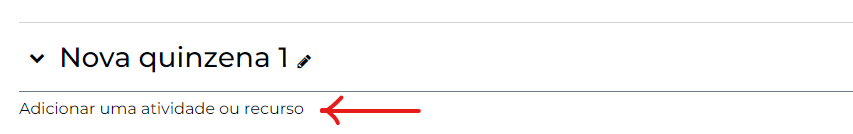
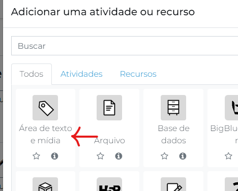
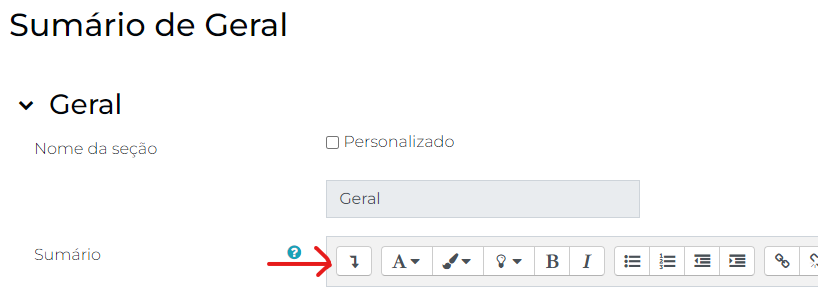
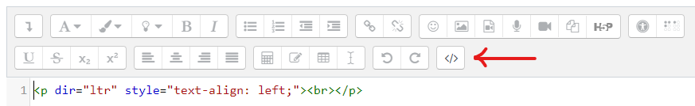
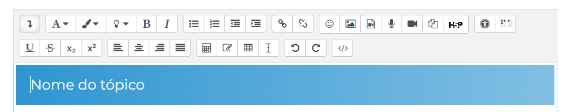
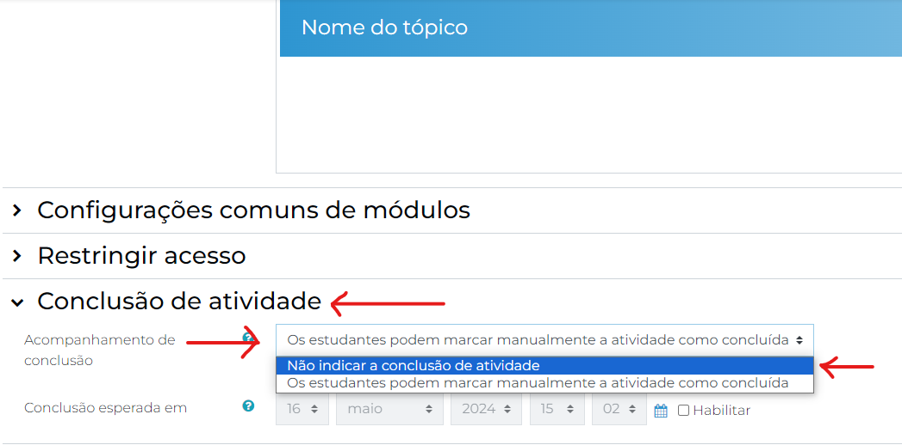

# Tópicos das Quinzenas

Utilizamos os tópicos de quinzena para separar os tipos de recursos que estão sendo apresentados em subseções (Textos, vídeos, atividades, etc.), visando melhorar a organização dos recursos e a experiência dos usuários da plataforma.

Para inserir um tópico, utilizaremos uma **Área de texto e mídia** (antigo Rótulo).

Clique em `Adicionar uma atividade ou recurso`.



Selecione `Área de texto e mídia`



Na próxima tela, na seção Sumário, clique na seta para baixo, como indicado na figura a seguir.



Em seguida, clique no símbolo `</>` para ativar o modo **editor HTML**. Você vai notar que o aparente texto em branco vai se tornar algo parecido com o demonstrado na figura a seguir.



Apague todo o texto contido nesta caixa e substitua pelo trecho de código a seguir:

```html
<p class="ppgp-rotulo-p">Nome do tópico</p>
```

Você pode substituir todo o conteúdo entre as duas *tags* `p` e escrever ali o nome do tópico que está configurando. Ou, caso não sinta segurança em escrever nessa tela, você pode clicar novamente em `</>`, no painel superior, e retornar para o modo clássico de edição.

Você vai perceber que o layout da primeira tela terá se ajustado à identidade visual do PPGP.



Você pode editar à vontade o nome do seu tópico nessa tela, sem precisar olhar mais para a edição em HTML.

## Importante

Para melhorar ainda mais a experiência de usuário, role a tela até o tópico `Conclusão de atividade`, depois, em *Acompanhamento de conclusão*, selecione **Não indicar conclusão de atividade**.



### Mas por quê?

Utilizando essa opção, a Área de texto e mídia será um recurso meramente visual na página, sem possibilidade de interação do usuário com o mesmo.

---

Feito isso, basta clicar em `Salvar mudanças` e o tópico da sua quinzena estará publicado.